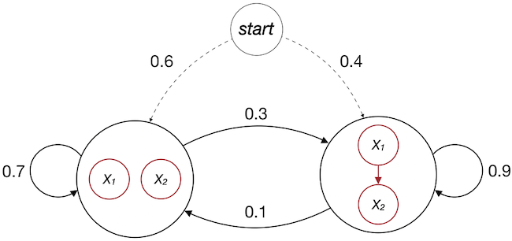

# Introduction
This vignette is designed to show the user how the *hmma* package can be used. This vignette will cover the following subjects:

1. Learn a HMM-A from a data set and using the *predict* function
2. Create a HMM-A according to a specific specification
3. Use the *simulate* function to create a data set from a HMM-A

## 1. Create a HMM-A from a data set
First, ensure that you installed the *hmma* package. Load the package using:

```{r}
library(hmma)
```

The *hma* package contains an example data set called 'hmmaExampleData'. This data set contains 3 variables (A, B and C) and has 100 observation sequences in which each observation is of length 20. All variable values must be discrete and must be represented as factors in the data set. You can see the contents of this file by typing the name in the console:

```r
hmmaExampleData
```

The first 5 rows are displayed below:

```{r}
head(hmmaExampleData$x, 5)
```

The data file must conform to a specific layout: it must be a list where the \$x component contains the observations and the \$N component is a list with all obersvation lengths.

Let us create a HMM-A with 3 states using this data set. To do so, the *learnModel* function must be used. The function returns a model that fits the data:

```{r}
fit <- learnModel(data = hmmaExampleData, amountOfStates = 3, seed = 1234)
```

To visualise the model, the *visualise* function can be used:

```{r}
visualise(fit)
```

This visualisation only shows the states and state transitions. The Bayesian networks are not visualised within the states as this would result in unreadable graphs. The Bayesian networks can be visualised using the *graphviz.plot* method from the *bnlearn* package. Each state can have a different Bayesian network. The BN for state 1 is visualised and inspected by:

```{r}
library(bnlearn)
fit$parms.emission[[1]]
graphviz.plot(fit$parms.emission[[1]])
```

We see that an arrow is drawn from A to B but C is unconnected. The other two BNs have a different structure (try them out and verify).

### Using a training and validation data set
Sometimes we want to use a training set and a validation set. Assume we have the following data sets:

```{r}
training <- list()
training$x <- hmmaExampleData$x[1:40,]
training$N <- c(20, 20)

validation <- list()
validation$x <- hmmaExampleData$x[41:60,]
validation$N <- c(20)
```

We can now create the model using the training data and check the performance (loglikelihood) using the validation data set:

```{r}
fit2 <- learnModel(training, amountOfStates = 2, seed = 1234)
loglikelihood <- predict(fit2, data = validation)$loglik
loglikelihood
```

In this way we can check for multiple states the loglikelihood of the data to the model. A model with a higher loglikelihood better represents the data. This example uses little data, but later in this vignette we will show an example using a larger data set.

### Demonstration of error with unrecognised data
Consider a data file with a variable age that can have three possible values: Y (young), I (intermediate) and O (old). The data set is given by:

|obs | Age |
|:--:|:---:|
| 1  |  Y  |
| 2  |  Y  |
| 3  |  I  |
| 4  |  I  |
| 5  |  Y  |
| 6  |  I  |
| 7  |  O  |
| 8  |  Y  |

```{r}
age <- c("Y", "Y", "I", "I", "Y", "I", "O", "Y")
data <- list()
data$x <- data.frame(age)
data$N <- c(8)
```

The data set is split into a training set and a validation set. The training data set consist out of the first 5 rows:

```{r}
training <- list()
age <- c("Y", "Y", "I", "I", "Y")
training$x <- data.frame(age, stringsAsFactors = TRUE)
training$N <- c(5)
```

Using this training data set we learn a model just as before:

```{r}
fit <- learnModel(data = training, amountOfStates = 2, seed = 1234)
visualise(fit)
```

Using a validation data set we can check the performance of the model (loglikelihood), assume the validation set contains only the last 3 rows of the complete data set:

```{r}
validation <- list()
age <- c("I", "O", "Y")
validation$x <- data.frame(age, stringsAsFactors = TRUE)
validation$N <- c(3)
```

To check the performance, we would use the *predict* function just as before:

```
loglikelihood <- predict(fit, data = validation)$loglik
```

This however results in an error: "Error in check.data(data): the data set contains Nan/NA values. ...". The reason is as follows: the model is trained with 5 examples that only contain the ages Young and Intermediate. No Old ages were encountered during the training and, consequently, the Bayesian networks that were fitted did not recognise the Old age group during validation. The Bayesian networks in the model can be inspected by:

```{r}
fit$parms.emission[[1]]
```

This problem can occur with small data sets or data sets that split the values of a variable in many discrete levels. Both increase the probability that a value is not observed in the training data set.

## 2. Create a HMMA via custom specification
Consider the situation in which we would like to create a HMM-A based on a specific specification (and not learned from a data file). For this, we need 3 elements:

1. An initial distribution (probability to start in a state)
2. A transition distribution (the transitions between the states)
3. An emission distribution (the Bayesian networks in the states)

For this example we contruct the HMM-A from the image below. 



We start with the initial distribution which can be specified using

```{r}
init <- c(0.6, 0.4)
init
```

Now we need to specify the transition distribution:


```{r}
trans <- matrix(c(0.7, 0.3, 0.1, 0.9), nrow = 2, ncol = 2, byrow = TRUE)
trans
```

Finally, the emission distributions must be specified. Each state has a different Bayesian network. We start with the network from state 1 (the leftmost state) and then create the Bayesian network from state 2. The image above does not show the conditional probability tables and therefore we will assume that X1 and X2 have possible values TRUE and FALSE with a certain probability. To learn more about the creation of Bayesian networks, please refer to the documenation of the *bnlearn* package ([bnlearn website](https://www.bnlearn.com)).

```{r}
library(bnlearn)
struc <- model2network("[X1][X2]")
cptX1 <- matrix(c(0.15, 0.85), ncol = 2, dimnames = list(NULL, c("TRUE", "FALSE")))
cptX2 <- matrix(c(0.7, 0.3), ncol = 2, dimnames = list(NULL, c("TRUE", "FALSE")))

bn1 <- custom.fit(struc, dist = list(X1 = cptX1,
                                     X2 = cptX2))

struc <- model2network("[X2|X1][X1]")
cptX1 <- matrix(c(0.4, 0.6), ncol = 2, dimnames = list(NULL, c("TRUE", "FALSE")))
cptX2 <- matrix(c(0.9, 0.1, 0.5, 0.5), nrow = 2, ncol = 2)
dimnames(cptX2) <- list("X2" = c("TRUE", "FALSE"),
                        "X1" = c("TRUE", "FALSE"))

bn2 <- custom.fit(struc, dist = list(X1 = cptX1,
                                     X2 = cptX2))

bns <- list()
bns[[1]] <- bn1
bns[[2]] <- bn2
```

Now it is time for final assembly. We use the function *createHmma* from the *hmma* package:

```{r}
model <- createHmma(init = init, trans = trans, bns = bns)
```

To visualise the model and the different Bayesian networks within the states:

```{r}
visualise(model = model)
```

```{r}
graphviz.plot(model$parms.emission[[1]])
graphviz.plot(model$parms.emission[[2]])
```

## 3. Use the *simulate* function to create a data set from a HMM-A

A HMM-A model can be used to generate simulated data. This can be done by using the *simulate* function. We use the model created in chapter 2 of this vignette.

```{r}
data <- simulate(model, nsim = c(20, 20, 20, 20), seed = 1234)
data
```

The data above consists of 4 seperate observation sequences, each of length 20. 


